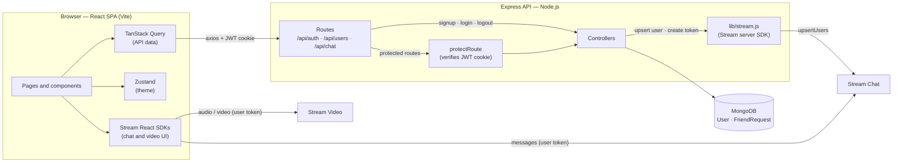

<h1 align="center">Linkify</h1>
<p align="center"><strong>From Words to Worlds – Connect with Linkify</strong></p>

<p align="center">
  
  
  
  
  
  
</p>

<p align="center">
  🔗 <strong>Live Demo:</strong> <a href="https://linkify-video-calling-chat-application.onrender.com">linkify-video-calling-chat-application.onrender.com</a> &nbsp;|&nbsp;
  📦 <a href="https://github.com/rishavk808/Linkify-video-calling-chat-application">Repository</a>
</p>

---

## Overview

Linkify is a full-stack MERN language exchange app. Users create an account, set up a profile with their native language and the language they are learning, connect with other learners through friend requests, and talk to their friends over real-time chat and video calls powered by GetStream.

The repository has two parts:

- **`backend/`** — a Node.js + Express REST API with MongoDB (Mongoose)
- **`frontend/`** — a React single-page app built with Vite

In production, the Express server also serves the built frontend.

## Features

### Authentication
- Sign up with full name, email and password (terms and conditions checkbox required)
- Server-side validation: all fields required, password of at least 6 characters, valid email format, email not already registered
- Passwords hashed with bcrypt in a Mongoose `pre("save")` hook
- On signup or login, a JWT is stored in an `httpOnly`, `sameSite: "strict"` cookie for 7 days (`secure` in production)
- Logout clears the cookie
- Protected on both sides: `protectRoute` middleware on the API, and redirects in `App.jsx` (logged out → `/login`, not onboarded → `/onboarding`)

### Onboarding & Profile
- Every new user is given a random DiceBear avatar at signup
- Onboarding form with full name, bio, native language, learning language and location — all required
- **Generate Random Avatar** button to change the profile picture
- 14 selectable languages, shown with country flags on friend and learner cards

### Home — Your Friends
- Grid of your friends with each friend's native and learning language
- **Message** button opens a 1-on-1 chat with that friend
- Empty state when you have no friends yet

### Home — Meet New Learners
- Lists every onboarded user who is not you and not already your friend (`GET /api/users`)
- Each card shows the user's avatar, name, location, languages and bio
- **Send Friend Request** button, which changes to **Request Sent** once a request is pending

### Friend Requests & Notifications
- Rules enforced by the API: you cannot send a request to yourself or to an existing friend, only one request can exist between two users, and only the recipient can accept it
- Accepting a request adds both users to each other's friends list
- Notifications page with incoming **Friend Requests** (count and **Accept** button) and **New Connections** (people who accepted your requests)

### Real-time Chat
- 1-on-1 chat between friends using GetStream Chat
- The channel ID is built from both user IDs, sorted and joined, so both users always open the same conversation
- Chat screen built from Stream's prebuilt components: `ChannelHeader`, `MessageList`, `MessageInput` and `Thread`

### Video Calls
- The video button in a chat posts a call link into the conversation
- Opening the link joins (or creates) the call using GetStream Video
- Call screen built from Stream's `SpeakerLayout` and `CallControls`; leaving the call returns you to Home

### Themes & Layout
- Theme picker in the navbar with 32 DaisyUI themes and colour previews
- Selected theme saved to `localStorage` through a Zustand store (default: `winter`)
- Navbar with notifications, theme picker, profile avatar and logout; sidebar with Home and Notifications links on large screens
- Responsive layout built with Tailwind CSS
- Toast messages (react-hot-toast) and loading screens for page loads, chat and calls

## Tech Stack

| Area | Technology | Used for |
|---|---|---|
| Frontend | React 19, Vite 6 | UI and build tooling |
| Routing | React Router 7 | Pages and auth/onboarding redirects |
| Server state | TanStack Query 5 | Fetching, caching and refetching API data (`useQuery` / `useMutation`) |
| Client state | Zustand 5 | Theme store |
| Styling | Tailwind CSS 3, DaisyUI 4 | Styling, components and the 32 themes |
| HTTP client | axios | API calls with cookies (`withCredentials: true`) |
| UI extras | lucide-react, react-hot-toast | Icons and toast messages |
| Backend | Node.js, Express 4 | REST API and serving the production build |
| Database | MongoDB, Mongoose 8 | Users and friend requests |
| Auth | jsonwebtoken, bcryptjs, cookie-parser | JWT sessions in cookies and password hashing |
| Chat | stream-chat, stream-chat-react | Real-time messaging |
| Video | @stream-io/video-react-sdk | Video calls |

## Architecture

The browser talks to the Express API for authentication, profiles and friends data. Chat messages and call audio/video go between the browser and Stream directly. The backend's role in Stream is to keep each user's Stream profile in sync and to issue a Stream user token from `GET /api/chat/token`, signed with the Stream API secret, which never leaves the server.



### How the main flows work

**Sign up**
1. `POST /api/auth/signup` validates the input, assigns a random avatar and creates the user (the password is hashed before saving).
2. The user is created in Stream with `upsertStreamUser`.
3. A JWT cookie is set. The frontend refetches `/api/auth/me`, and the user is redirected to onboarding.

**Opening a chat**
1. The frontend gets a Stream token from `GET /api/chat/token`.
2. `StreamChat.connectUser()` connects the user to Stream Chat with that token.
3. The channel ID is `[myId, friendId].sort().join("-")`, and `channel.watch()` loads the conversation.

**Starting a video call**
1. The video button sends a message containing a link to `/call/<channelId>`.
2. `CallPage` creates a `StreamVideoClient` with the same token and runs `call("default", callId).join({ create: true })`.

## API Endpoints

| Method | Endpoint | Protected | Description |
|---|---|:---:|---|
| POST | `/api/auth/signup` | | Create an account and set the JWT cookie |
| POST | `/api/auth/login` | | Log in and set the JWT cookie |
| POST | `/api/auth/logout` | | Clear the JWT cookie |
| POST | `/api/auth/onboarding` | ✅ | Save the profile and mark the user as onboarded |
| GET | `/api/auth/me` | ✅ | Get the logged-in user |
| GET | `/api/users` | ✅ | Onboarded users who are not you or your friends |
| GET | `/api/users/friends` | ✅ | Your friends |
| POST | `/api/users/friend-request/:id` | ✅ | Send a friend request |
| PUT | `/api/users/friend-request/:id/accept` | ✅ | Accept a friend request |
| GET | `/api/users/friend-requests` | ✅ | Incoming pending requests, and your requests that were accepted |
| GET | `/api/users/outgoing-friend-requests` | ✅ | Requests you sent that are still pending |
| GET | `/api/chat/token` | ✅ | Get a Stream user token |

## Data Models

**User** — `fullName`, `email` (unique), `password` (hashed, min 6 characters), `bio`, `profilePic`, `nativeLanguage`, `learningLanguage`, `location`, `isOnboarded`, `friends` (references to other users), timestamps

**FriendRequest** — `sender`, `recipient`, `status` (`pending` or `accepted`), timestamps

## Project Structure

```
Linkify-video-calling-chat-application/
├── backend/
│   └── src/
│       ├── controllers/     # auth, user and chat handlers
│       ├── lib/              # db.js (MongoDB connection), stream.js (Stream server SDK)
│       ├── middleware/       # protectRoute
│       ├── models/           # User, FriendRequest
│       ├── routes/           # auth.route, user.route, chat.route
│       └── server.js
├── frontend/
│   └── src/
│       ├── components/       # Navbar, Sidebar, ThemeSelector, FriendCard, CallButton, loaders, empty states
│       ├── constants/         # THEMES, LANGUAGES, LANGUAGE_TO_FLAG
│       ├── hooks/             # useAuthUser, useLogin, useSignUp, useLogout
│       ├── lib/                # api.js, axios.js, utils.js
│       ├── pages/              # SignUp, Login, Onboarding, Home, Notifications, Chat, Call
│       ├── store/               # useThemeStore (Zustand)
│       ├── App.jsx              # routes and redirects
│       └── main.jsx             # Router and TanStack Query providers
└── package.json                 # root build and start scripts
```

## Getting Started

### Requirements
- Node.js and npm
- A MongoDB connection string
- A GetStream app (API key and API secret)

### Run locally

```bash
git clone https://github.com/rishavk808/Linkify-video-calling-chat-application.git
cd Linkify-video-calling-chat-application

# backend (create backend/.env first — see below)
cd backend
npm install
npm run dev        # nodemon

# frontend (in a second terminal)
cd frontend
npm install
npm run dev        # Vite, http://localhost:5173
```

> In development, the frontend calls the API at `http://localhost:5001/api` (see [`frontend/src/lib/axios.js`](frontend/src/lib/axios.js)), so set `PORT=5001` in the backend `.env`.

### Environment variables

**`backend/.env`**

| Variable | Description |
|---|---|
| `PORT` | Port for the Express server (`5001` for local development) |
| `NODE_ENV` | `development` or `production` |
| `MONGO_URI` | MongoDB connection string |
| `JWT_SECRET_KEY` | Secret used to sign JWTs |
| `STREAM_API_KEY` | GetStream API key |
| `STREAM_API_SECRET` | GetStream API secret (server only) |

**`frontend/.env`**

| Variable | Description |
|---|---|
| `VITE_STREAM_API_KEY` | GetStream API key (same as `STREAM_API_KEY`) |

## Production Build

From the repository root:

```bash
npm run build   # installs backend and frontend dependencies, builds the frontend
npm start       # starts the backend
```

With `NODE_ENV=production`, the Express server serves `frontend/dist` and returns `index.html` for all other routes.

---

<p align="center">Built by <a href="https://github.com/rishavk808">Rishav Kumar</a></p>
