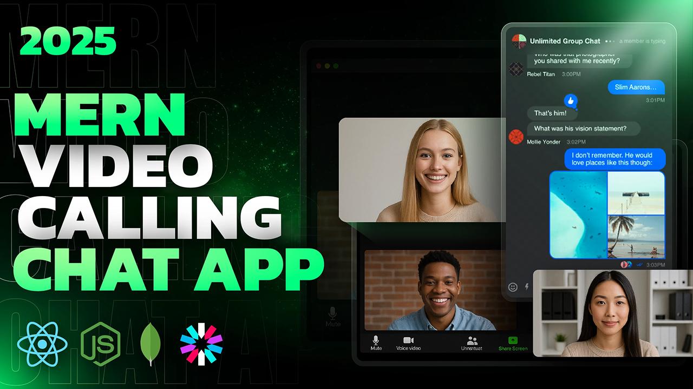
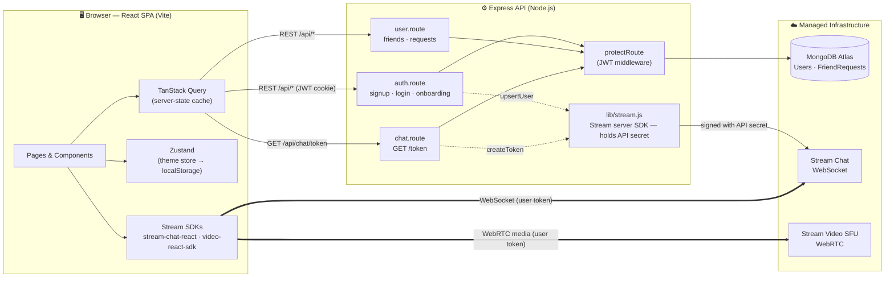

<h1 align="center">🌍 Linkify</h1>
<p align="center"><strong>A real-time language exchange platform — chat and video-call your way to fluency.</strong></p>

<p align="center">
  
  
  
  
  
  
  
</p>

<p align="center">
  
</p>

<p align="center">
  🔗 <strong>Live Demo:</strong> <em>add your deployed URL here</em> &nbsp;|&nbsp;
  📦 <a href="https://github.com/rishavk808/Linkify-video-calling-chat-application">Repository</a>
</p>

---

## 📖 Overview

**Linkify** is a full-stack MERN application that connects people learning a new language with native speakers of it, so they can practise together — over real-time text chat and 1-on-1 video calls.

A user signs up, completes a short onboarding profile (native language, language they're learning, bio, location), gets a list of recommended language partners, sends and accepts friend requests, and can then open a live chat with any friend or escalate that conversation straight into a video call with screen sharing — all skinned in any of **32 switchable UI themes**.

The project is a monorepo: a `backend/` Express + MongoDB REST API, and a `frontend/` React single-page app built with Vite. In production, the same Express server also serves the built React bundle, so the whole thing deploys as a single service.

## 📑 Table of Contents

- [Features](#-features)
- [Tech Stack](#-tech-stack--why)
- [Architecture](#-architecture)
- [How a Request Actually Flows](#-how-a-request-actually-flows)
- [Project Structure](#-project-structure)
- [Getting Started](#-getting-started)
- [Environment Variables](#-environment-variables)
- [Deployment](#-deployment)
- [Roadmap](#-roadmap)
- [License](#-license)

## ✨ Features

**Authentication & Onboarding**
- Email/password signup and login with bcrypt-hashed passwords
- Stateless sessions via JWT stored in an `httpOnly`, `sameSite=strict` cookie
- Protected routes guarded by Express middleware and by the React router
- Guided onboarding (bio, native language, learning language, location, avatar)

**Social Graph**
- Recommended-partner discovery (onboarded users who aren't already friends)
- Friend requests — send, accept, and track incoming/outgoing requests
- A notifications page for pending requests and new connections

**Real-Time Messaging**
- 1-on-1 chat powered by GetStream Chat — typing indicators, reactions, threads, message history
- Deterministic channel IDs, so both participants always land in the same conversation
- Delivered over a persistent WebSocket, not polling

**Video Calling**
- 1-on-1 video calls launched directly from a chat, powered by GetStream Video (WebRTC)
- Screen sharing and full call controls via `@stream-io/video-react-sdk`
- Calls are routed through a managed SFU — no self-hosted media servers

**UI & Theming**
- 32 DaisyUI themes, switchable at runtime, persisted to `localStorage`
- Fully responsive layout (Tailwind CSS breakpoints, mobile-first)
- Toast notifications and loading states throughout

**Client Engineering**
- TanStack Query for server-state caching, request de-duplication, and targeted cache invalidation
- Zustand for lightweight global UI state (the theme)

## 🧱 Tech Stack & Why

| Layer | Technology | Why it's here |
|---|---|---|
| UI | **React 19** + **Vite 6** | Stream's SDKs ship first-class React components; Vite gives instant HMR and a fast production build |
| Routing | **React Router 7** | Declarative route guards driven by `isAuthenticated` / `isOnboarded` |
| Styling | **Tailwind CSS** + **DaisyUI** | Utility-first styling, plus 32 ready-made themes switched with a single `data-theme` attribute |
| Server state | **TanStack Query** | Caching, request de-duplication, and invalidation — no manual `useEffect` fetch/loading boilerplate |
| Client state | **Zustand** | A ~1 KB store for the one piece of global, client-only state: the active theme |
| Runtime | **Node.js** + **Express 4** | I/O-bound workload (DB + Stream calls); Express serves the API and, in production, the built frontend |
| Database | **MongoDB** + **Mongoose** | The data is document-shaped (a user with an embedded friends array, a small requests collection) — no complex joins needed |
| Auth | **JWT** + **bcryptjs** | Stateless sessions in an `httpOnly` cookie; salted, adaptive-cost password hashing |
| Real-time chat | **GetStream Chat** (`stream-chat`, `stream-chat-react`) | Managed WebSocket messaging, presence, and history — no chat server to run or scale |
| Video calling | **GetStream Video** (`@stream-io/video-react-sdk`) | A WebRTC client routed through Stream's managed SFU — no media servers or TURN relays to operate |

## 🏗️ Architecture

Three parties are involved: the **browser**, **this project's API**, and **managed infrastructure** (MongoDB Atlas + Stream). The deliberate design choice is that real-time traffic — every chat message and every video/audio packet — never passes through the Express server. The backend only handles authentication, the social graph, and issuing Stream tokens; once a client has a token, it talks to Stream directly.



**Why this shape:** real-time messaging and media are the hardest things to operate at scale — presence, fan-out, reconnection, TURN relays, codec negotiation, global edges. Pushing that to a managed vendor keeps the Express API a stateless CRUD service that can restart, redeploy, or scale horizontally without ever dropping a live call. See [`backend/src/lib/stream.js`](backend/src/lib/stream.js) for the entire integration surface — two functions, one file, one place the API secret ever lives.

## 🔄 How a Request Actually Flows

**Sign up**
1. `POST /api/auth/signup` validates input, hashes the password (Mongoose `pre("save")` hook + bcrypt), and creates the user.
2. The same user is mirrored into Stream via `upsertStreamUser`.
3. A JWT is signed and set as an `httpOnly` cookie; the client refetches `/auth/me` and the app unlocks onboarding.

**Opening a chat**
1. The client requests a Stream token from `GET /api/chat/token` (protected by `protectRoute`).
2. `StreamChat.connectUser(user, token)` opens a WebSocket directly to Stream.
3. The channel ID is computed client-side as `[myId, theirId].sort().join("-")`, so both participants always resolve the same 1-on-1 channel with no extra "create conversation" API call.

**Starting a video call**
1. The chat's video button sends a chat message containing a link to `/call/<channelId>`.
2. `CallPage` reuses the cached Stream token, creates a `StreamVideoClient`, and calls `call("default", callId).join({ create: true })`.
3. From here, media flows entirely between the browser and Stream's SFU — the Express server is no longer involved.

## 📁 Project Structure

```
Linkify-video-calling-chat-application/
├── backend/
│   └── src/
│       ├── controllers/     # auth, user, chat request handlers
│       ├── lib/              # db.js (Mongo connection), stream.js (Stream service layer)
│       ├── middleware/       # protectRoute (JWT verification)
│       ├── models/           # User, FriendRequest (Mongoose schemas)
│       ├── routes/           # auth.route, user.route, chat.route
│       └── server.js
├── frontend/
│   └── src/
│       ├── components/       # Navbar, Sidebar, ThemeSelector, FriendCard, loaders, …
│       ├── constants/         # THEMES, LANGUAGES, LANGUAGE_TO_FLAG
│       ├── hooks/             # useAuthUser, useLogin, useSignUp, useLogout
│       ├── lib/                # api.js (endpoints), axios.js, utils.js
│       ├── pages/              # Login, SignUp, Onboarding, Home, Notifications, Chat, Call
│       ├── store/               # useThemeStore (Zustand)
│       ├── App.jsx              # routes & auth/onboarding guards
│       └── main.jsx             # React Query + Router providers
└── package.json                 # root build/start scripts for single-service deployment
```

## ⚙️ Getting Started

### Prerequisites
- Node.js 18+
- A MongoDB connection string ([MongoDB Atlas](https://www.mongodb.com/atlas) free tier works)
- A [GetStream.io](https://getstream.io/) app — you'll need its **API key** and **API secret**

### Local development

```bash
# clone
git clone https://github.com/rishavk808/Linkify-video-calling-chat-application.git
cd Linkify-video-calling-chat-application

# backend — create backend/.env (see table below) first
cd backend
npm install
npm run dev        # nodemon, http://localhost:5001

# in a second terminal — frontend
cd frontend
npm install
npm run dev         # Vite, http://localhost:5173
```

> The frontend's dev API base URL is hardcoded to `http://localhost:5001/api` in [`frontend/src/lib/axios.js`](frontend/src/lib/axios.js) — keep the backend's `PORT` at `5001` locally, or update that file to match.

### Production-style build (single service)

```bash
npm run build   # from the repo root: installs both workspaces, builds the frontend
npm start       # starts the backend, which serves frontend/dist when NODE_ENV=production
```

## 🔐 Environment Variables

**`backend/.env`**

| Variable | Description |
|---|---|
| `PORT` | Port the Express server listens on (e.g. `5001`) |
| `NODE_ENV` | `development` or `production` — controls static-file serving and cookie `secure` flag |
| `MONGO_URI` | MongoDB connection string |
| `JWT_SECRET_KEY` | Secret used to sign/verify session JWTs |
| `STREAM_API_KEY` | GetStream app API key (publishable) |
| `STREAM_API_SECRET` | GetStream app API secret — **server-only, never exposed to the client** |

**`frontend/.env`**

| Variable | Description |
|---|---|
| `VITE_STREAM_API_KEY` | The same GetStream **API key** as above (publishable — safe in the browser) |

## 🚀 Deployment

The root [`package.json`](package.json) is set up for single-service hosting (e.g. Render, Railway, a VPS): `npm run build` installs both workspaces and builds the React app, and `npm start` boots the Express server, which — when `NODE_ENV=production` — serves `frontend/dist` directly and falls back to `index.html` for client-side routing. One service, one deploy, no separate frontend host or CORS to configure in production.

## 🗺️ Roadmap

- [ ] Rank recommended partners by language complementarity, not just "not already a friend"
- [ ] Real-time friend-request notifications (via Stream custom events) instead of fetch-on-mount
- [ ] Refresh-token rotation instead of a single long-lived JWT
- [ ] Rate limiting on authentication routes
- [ ] Automated tests for the controllers and data model

## 📄 License

ISC — see [`package.json`](package.json).

---

<p align="center">Built by <a href="https://github.com/rishavk808">Rishav Kumar</a></p>
